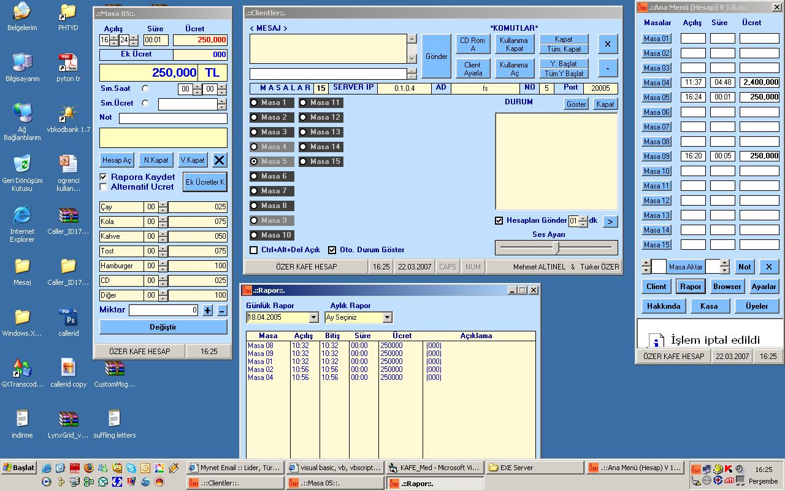



## Internet Cafe Program\(remote Control in local Network\)

### Description

client and server side remote control. you use this programs and it has some example code for make an aplication about any topic.
 
### More Info
 

             |
---                |---
**Submitted On**   |2007-03-07 01:50:28
**By**             |[Mehmet ALTINEL](https://github.com/Planet-Source-Code/PSCIndex/blob/master/ByAuthor/mehmet-altinel.md)
**Level**          |Advanced
**User Rating**    |5.0 (10 globes from 2 users)
**Compatibility**  |VB 6\.0
**Category**       |[Complete Applications](https://github.com/Planet-Source-Code/PSCIndex/blob/master/ByCategory/complete-applications__1-27.md)
**World**          |[Visual Basic](https://github.com/Planet-Source-Code/PSCIndex/blob/master/ByWorld/visual-basic.md)
**Archive File**   |[Internet\_C2055283222007\.zip](https://github.com/Planet-Source-Code/mehmet-altinel-internet-cafe-program-remote-control-in-local-network__1-68184/archive/master.zip)

